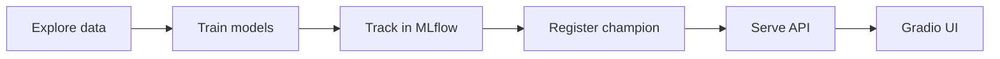

# Bank churn workshop demo

A small churn prediction demo: explore customer data, train and compare models, track experiments in MLflow, register a champion, then serve it behind a Gradio form.

Slides are at [https://dmymi.github.io/ai-public-workshop](https://dmymi.github.io/ai-public-workshop).

## Overview



| Step | Where | What happens |
|------|-------|--------------|
| 1 | `notebooks/01_explore_and_prepare.ipynb` | Load data, inspect schema, plot churn patterns |
| 2 | `notebooks/02_train_track_register.ipynb` | Train models, log to MLflow, register champion |
| 3 | `mlflow run . -e serve` | MLflow model server on port 5001 |
| 4 | `app/gradio_ui.py` | Web form that hits the server |

## Prerequisites

- Python 3.12
- A virtual environment (recommended)

## Setup

From the project root:

```bash
python -m venv .venv
source .venv/bin/activate   # Windows: .venv\Scripts\activate
pip install -r requirements.txt
```

## Demo flow

Run these in order. For the live demo you'll want three terminals open (MLflow UI is optional).

### 1. Explore the data

Run all cells in `notebooks/01_explore_and_prepare.ipynb`.

You should get summary tables and a handful of Plotly charts.

### 2. Train, track, and register

Run all cells in `notebooks/02_train_track_register.ipynb`.

That creates `mlflow.db` in the project root, logs a bunch of training runs, and registers the best one as `BankChurnModel` with the `champion` alias. Takes a few minutes.

### 3. MLflow UI (optional)

Terminal 1:

```bash
source .venv/bin/activate
mlflow ui --backend-store-uri sqlite:///$(pwd)/mlflow.db
```

Open http://127.0.0.1:5000. The `bank-churn` experiment and `BankChurnModel` registry entry are the interesting bits.

### 4. Model server

Terminal 2 (leave it running). Use the `serve` entry point from `MLproject`, not `python src/serve.py` directly:

```bash
source .venv/bin/activate
mlflow run . -e serve
```

Serves `models:/BankChurnModel@champion` at http://127.0.0.1:5001 by default.

To change port or alias:

```bash
mlflow run . -e serve -P port=5002
mlflow run . -e serve -P alias=champion -P port=5001
```

### 5. Gradio UI

Terminal 3 (model server still running):

```bash
source .venv/bin/activate
python app/gradio_ui.py
```

Open http://localhost:7861, fill in the form, click **Predict churn**.

If the server isn't on the default URL:

```bash
MLFLOW_SERVE_URL=http://127.0.0.1:5001/invocations python app/gradio_ui.py
```

## Project layout

```
├── data/
│   └── bank_customers.csv
├── notebooks/
│   ├── 01_explore_and_prepare.ipynb
│   └── 02_train_track_register.ipynb
├── src/
│   ├── config.py
│   └── serve.py                # called by MLproject serve entry point
├── app/
│   ├── mlflow_api.py
│   └── gradio_ui.py
├── slides/
├── MLproject                   # mlflow run -e serve
├── python_env.yaml
└── requirements.txt
```

## How inference is wired

```
Browser (Gradio UI :7861)
        │  HTTP POST (dataframe_split JSON)
        ▼
MLflow model server (:5001)
        │  loads models:/BankChurnModel@champion
        ▼
sklearn Pipeline (preprocessing + classifier)
```

The UI never loads the model itself. It just POSTs to the MLflow `/invocations` endpoint, same as any other client would.

## Troubleshooting

| Problem | Likely cause | Fix |
|---------|--------------|-----|
| `Connection refused` from Gradio | Model server not running | Run `mlflow run . -e serve` first |
| `RESOURCE_DOES_NOT_EXIST` on serve | Notebook 2 not run yet | Run `02_train_track_register.ipynb` |
| Port already in use | Old server still up | Kill it or pass `--port` |
| Empty MLflow UI | Wrong backend URI | `sqlite:///$(pwd)/mlflow.db` from project root |

## License

See [LICENSE](LICENSE).
