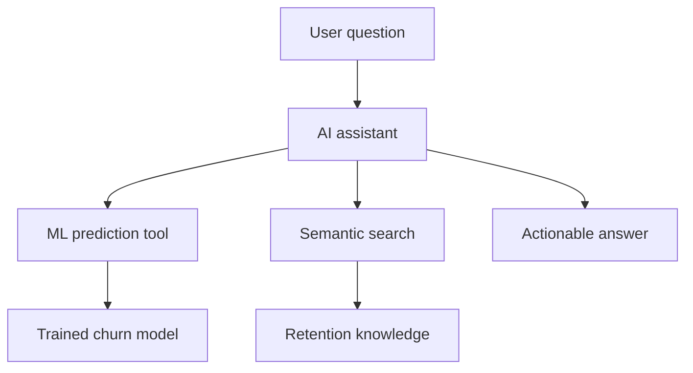

# Classic ML meets modern AI

---

## Beyond the prediction

<v-clicks>

- A churn score tells you *who*. It doesn't always tell you *what to do next*.
- Semantic search over retention playbooks: ask in plain language, get relevant actions back
- An LLM can explain the result and suggest next steps without making up the underlying score

</v-clicks>

<v-click>

GenAI sits on top of the model. It doesn't replace the part that has to be right.

</v-click>

---

## Two layers, one solution

<v-click>

ML for the numbers. GenAI for search, conversation, and explanation.

</v-click>
