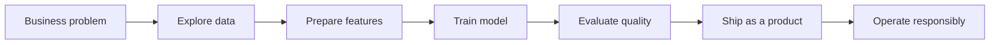

# The journey

Problem, data, model, product.

---

## A real problem to solve

<v-clicks>

- Banks lose money when customers leave. That's churn.
- We have a dataset of customer profiles and behaviour
- The question: *who is likely to leave, and what can we do about it?*

</v-clicks>

<!--
This is the hook. We are not inventing a toy exercise — churn is a classic, relatable business case.
-->

---

## End-to-end in one arc

<v-click>

Today's demo walks through most of this arc, live.

</v-click>
